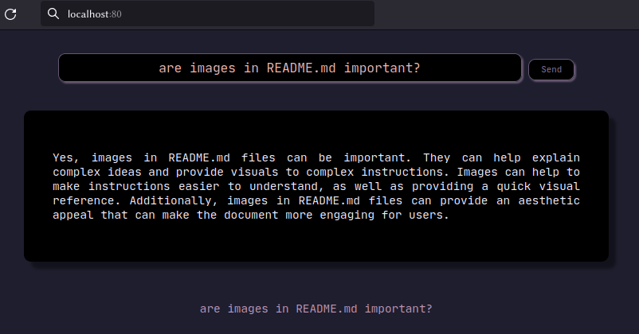

Deploy a single page php-apache server in a docker :

```bash
git clone https://github.com/dougy147/docker-minigpt
cd ./docker-minigpt
docker-compose up -d
```

then visit `http://localhost:80`

[]()
